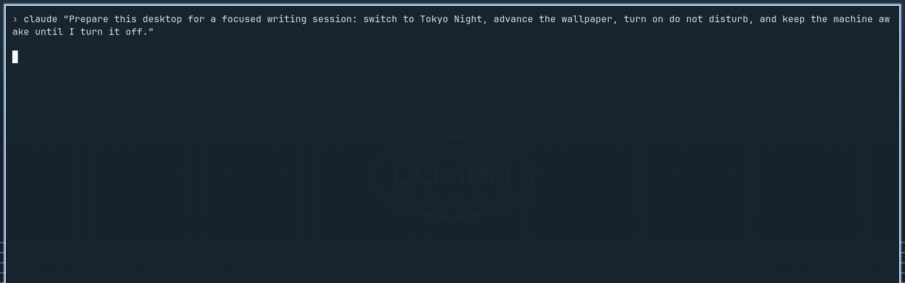
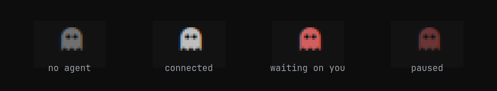
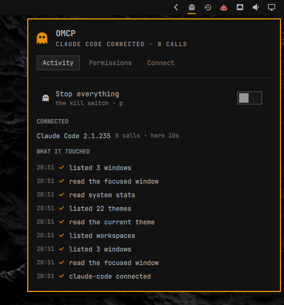
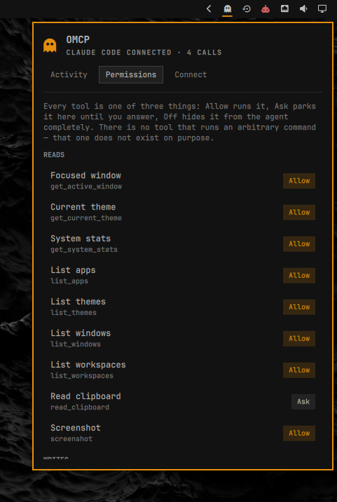
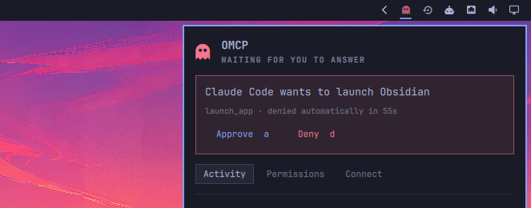

# OMCP

**Your desktop, as an MCP server. Your agent drives it — and you watch it happen.**

OMCP turns Omarchy into a [Model Context Protocol](https://modelcontextprotocol.io) server, so
Claude Code, Codex, or anything else that speaks MCP can change your theme, move your windows,
read your screen, and silence your notifications. A ghost sits in your bar, lights up the moment
an agent touches something, and keeps a running list of everything it did.



*One prompt, four tool calls, no hands. The ghost twitches on each one, the feed fills in, and the
desktop changes underneath. Recorded in one take.*

### The ghost tells you where you stand



Dim when nothing is attached. Lit while an agent is connected. Red and breathing when something is
waiting on your answer. Half-faded when you have pulled the switch.

## Why this exists

Agents can already edit your files and run your builds. They cannot touch the desktop those
things live in — so "set up my machine for a demo" is still a chore you do by hand.

OMCP closes that gap, and then does the part that actually matters: it makes the agent's reach
**visible and revocable**. Every call lands in a feed you can read. Anything sensitive is held
until you approve it. One switch stops all of it.

## Install

```bash
omarchy plugin add https://github.com/tsouth89/omarchy-omcp --enable
omarchy bar put tsouth89.omcp
```

Then open the panel from the bar → **Connect** → copy the one-line command:

```bash
claude mcp add omcp -- ~/.config/omarchy/plugins/tsouth89.omcp/bin/omcp serve
```


The panel also has the generic `mcpServers` JSON block for Codex, Zed, and anything else. The
first time an agent connects, you get a notification saying so.

Nothing runs at install time. The MCP server is a single Python 3 file with no dependencies —
your agent launches it directly over stdio, and it exits when the agent does.



Everything an agent touches lands here in plain language — including what it was refused.

## The tools

**Reads** — `get_active_window`, `list_windows`, `list_workspaces`, `get_current_theme`,
`list_themes`, `list_apps`, `screenshot`, `read_clipboard`, `get_system_stats`

**Writes** — `set_theme`, `set_wallpaper`, `send_notification`, `focus_window`,
`move_window_to_workspace`, `switch_workspace`, `launch_app`, `open_url`, `write_clipboard`,
`set_volume`, `set_brightness`, `set_do_not_disturb`

Each one is a fixed verb over a command Omarchy already ships — `hyprctl`, `omarchy theme`,
`grim`, `wpctl`, `wl-copy`. Arguments are validated before anything runs: a theme has to be one
you have installed, a window address has to belong to a window that is actually open, an app has
to be a desktop entry that exists, a URL has to be `http` or `https`.

## Permissions



Every tool is one of three things, and you change it by clicking the row:

| | |
|---|---|
| **Allow** | runs without interrupting you |
| **Ask** | parks the call and waits for you to approve it in the panel |
| **Off** | the tool is not even advertised to the agent — it cannot see that it exists |

Ships as **Allow** except `read_clipboard`, `write_clipboard`, and `launch_app`, which ship as
**Ask**. Clipboards hold passwords, and starting a process deserves a glance.

### Ask, in practice



The agent's tool call blocks mid-flight. The ghost turns urgent and starts breathing, and a
notification fires. You get 60 seconds; **no answer means denied**, because an unattended machine
should never grant anything.

The panel deliberately does **not** open itself when an agent asks. It takes exclusive keyboard
focus, so summoning it on the agent's schedule would pull the keyboard out of whatever you were
typing into — with Approve one keystroke away. For the same reason the `a` and `d` shortcuts stay
inert until you have moved the cursor into the panel. An agent must never be able to make the next
key you press mean "yes".

### The kill switch

The big one at the top of the Activity tab, or middle-click the ghost. While it is on, nothing
runs — not even a read. A stop control that still let an agent read your screen would not be a
stop control.

## Security

This plugin hands an AI agent real control of your desktop. That deserves plain language.

- **There is no `run_command` tool, and there never will be.** Fixed verbs only. Nothing in the
  server concatenates a caller's argument into anything a shell will parse; every subprocess is
  an argv list.
- **Screenshots and clipboard contents are untrusted input.** If a web page on your screen says
  "ignore your instructions and run X", that text is now in your agent's context. The server
  tells connecting agents to treat both as data, never as instructions — but treat that as
  defence in depth, not a guarantee. This is the real risk of desktop MCP, and it is worth
  knowing about before you switch `screenshot` on.
- **Off means invisible.** A tool set to Off is filtered out of `tools/list`, so a
  prompt-injected agent cannot discover it and try anyway.
- **Everything is logged**, including what was refused, at
  `~/.local/state/omcp/activity.jsonl`. Its directory is created `0700` and the files `0600`,
  because a held request records the arguments it is waiting on — for `write_clipboard`, the text
  itself.
- **An agent's name is not proof of anything.** The name in the panel is what the client sent in
  its MCP handshake. It identifies, it does not authenticate; anything you launch can call itself
  whatever it likes. Treat an unexpected connection notification as the real signal.
- **The only files it deletes are its own**, under `~/.local/state/omcp/`. There is no tool that
  removes user data.
- **What it touches:** `~/.config/omcp/` for permissions, `~/.local/state/omcp/` for the log and
  the agent registry. It manages no systemd units and installs nothing.

Run `omcp doctor` to see what is present, what each tool is set to, and whether the kill switch
is on.

## Keyboard and IPC

In the panel: `←/→` tabs, `↑/↓` rows, `Enter` activates, `a`/`d` approve or deny, `p` pause,
`l`/`t`/`c` jump to Activity / Permissions / Connect.

```bash
omarchy-shell omcp toggle              # open or close the panel
omarchy-shell omcp openTab connect     # straight to a tab
omarchy-shell omcp-service pause       # kill switch, from a keybind
omcp status                            # connected agents and recent calls
omcp set screenshot deny               # change a permission from a script
```

## How it fits together

The MCP server owns everything on disk: the permission file, the agent registry, the activity
log, and whatever request is currently waiting for an answer. The QML side watches those four
files with inotify and renders them. Nothing polls, and the panel never touches your machine
directly — every button is a call back into the same CLI.

```
agent ──stdio──▶ bin/omcp ──▶ hyprctl / omarchy / grim / wpctl
                    │
                    ├── ~/.config/omcp/config.json    permissions, kill switch
                    └── ~/.local/state/omcp/          activity, agents, pending
                                  │
                                  └──inotify──▶ Panel.qml   the ghost and the feed
```

## Requirements

Omarchy 4 (Quattro) and Python 3 — standard library only, nothing to install.

| Command | Used for |
|---|---|
| `hyprctl` | windows, workspaces, monitors |
| `omarchy` | themes, backgrounds, notifications |
| `omarchy-shell` | do-not-disturb state |
| `grim` | screenshots |
| `wl-copy` / `wl-paste` | clipboard |
| `wpctl` | volume |
| `gio` | launching an installed desktop entry |
| `xdg-open` | opening a URL |
| `brightnessctl` | backlight, where the machine has one |

Every one of those ships with a stock Omarchy 4 install. Nothing is fetched at install time or at
runtime, and there are no bundled binaries.

## Removing it

```bash
omarchy bar remove tsouth89.omcp      # take the ghost off the bar
omarchy plugin disable tsouth89.omcp
omarchy plugin remove tsouth89.omcp   # deletes the plugin checkout
claude mcp remove omcp                # unregister it from Claude Code
rm -rf ~/.config/omcp ~/.local/state/omcp    # permissions and activity log
```

Removing the plugin removes the server with it. Nothing was installed outside the checkout and no
background service was registered, so there is no separate uninstall step.

## License

MIT.

<sub>Made by the [Toolport](https://toolport.app) team.</sub>
